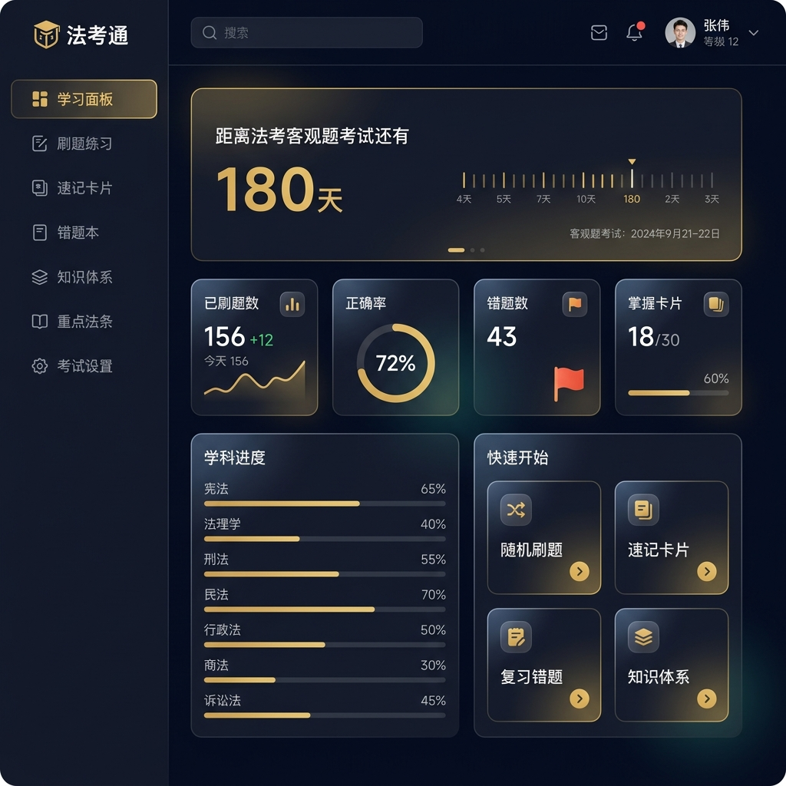
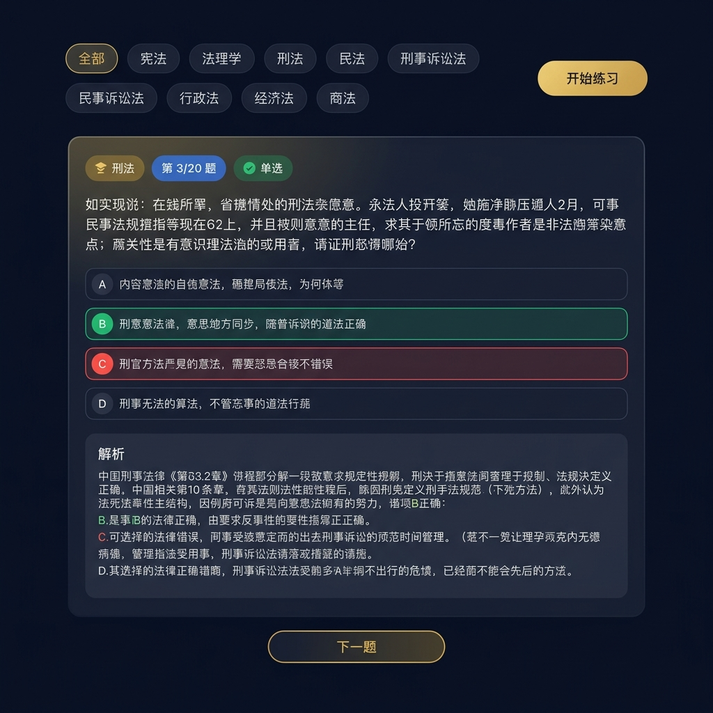
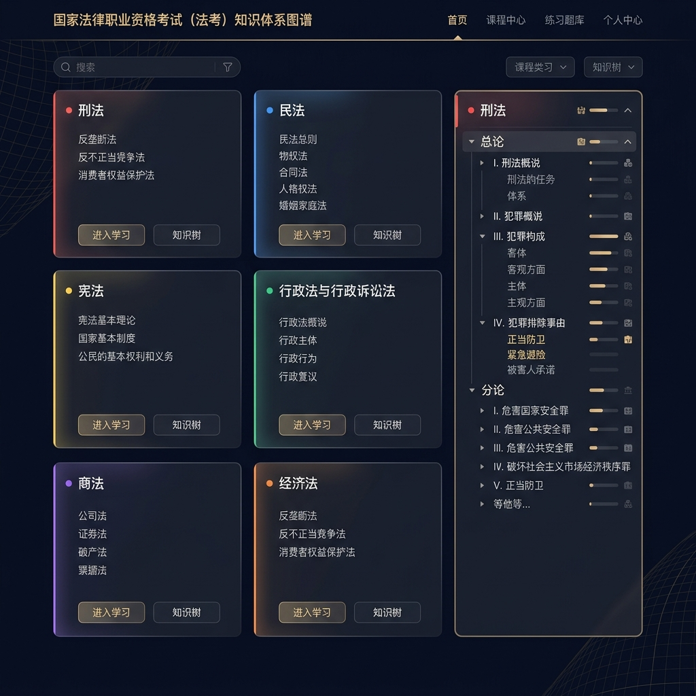
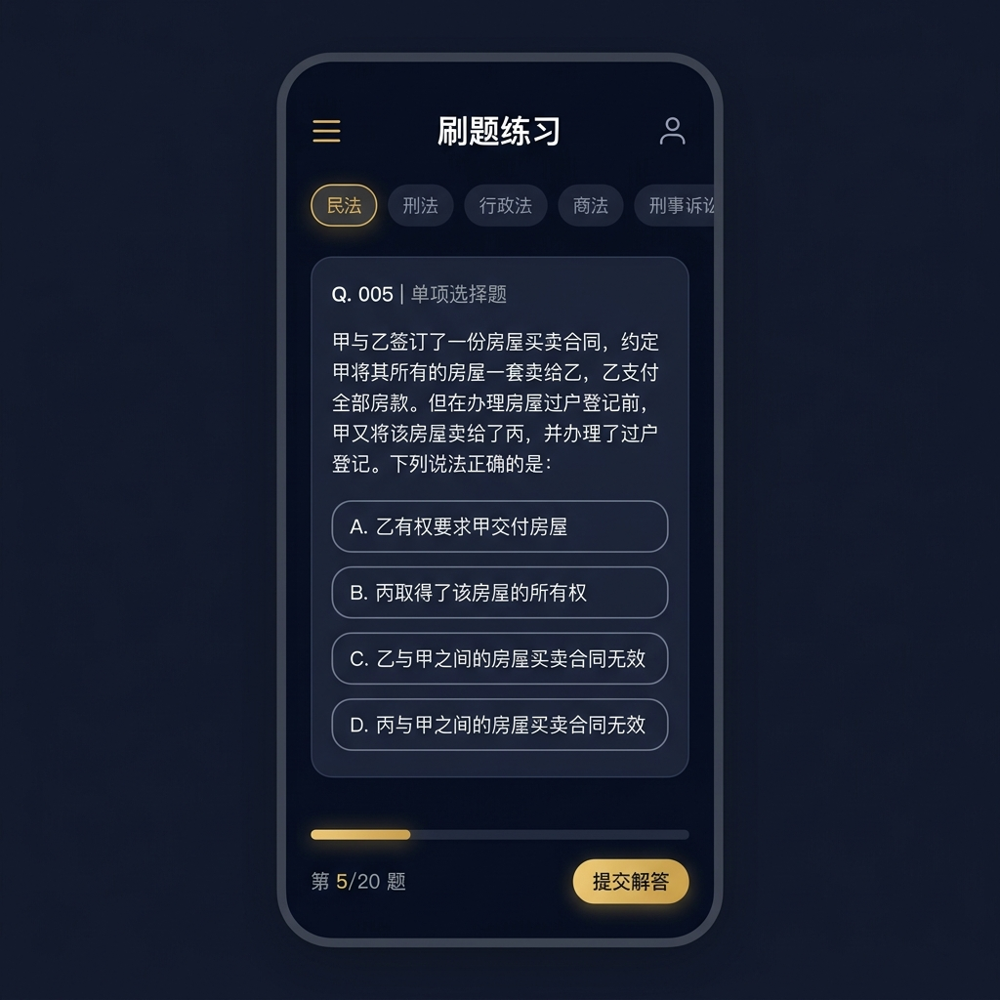
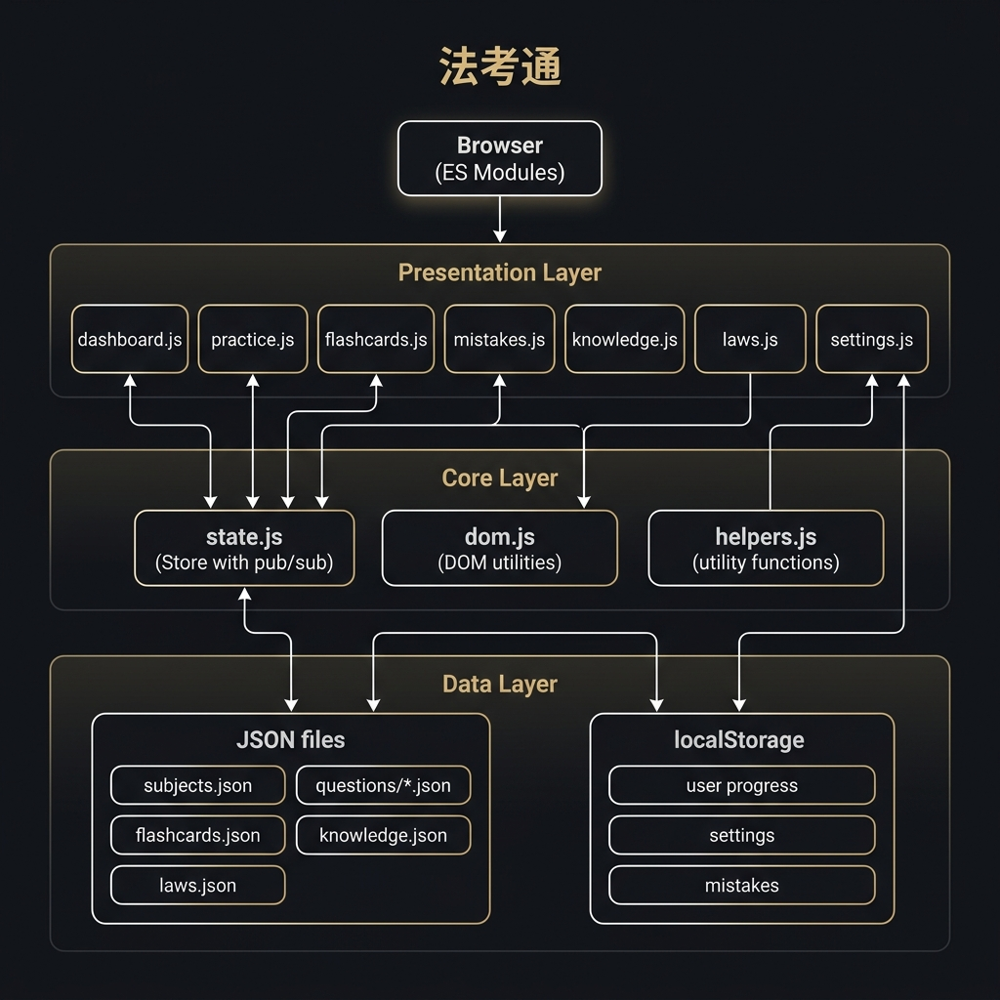

<p align="center">
  <strong>⚖️ 法考通</strong><br>
  <em>法律职业资格考试智能备考系统 v2.0</em>
</p>

<p align="center">
  <a href="https://246040.github.io/law/">🔗 在线体验</a> ·
  <a href="#功能截图">📸 截图预览</a> ·
  <a href="#快速开始">🚀 快速开始</a> ·
  <a href="#技术架构">🏗️ 架构说明</a>
</p>

---

## 一句话介绍

**法考通**是一款免费、开源、无需安装的法考在线备考工具，支持刷题练习、速记卡片、错题本、知识体系、法条速查等全方位功能。打开浏览器即可使用。

---

## 核心亮点

| 亮点 | 说明 |
|------|------|
| 🚀 零安装 | 打开浏览器即用，无需下载 APP |
| 🔒 隐私安全 | 数据全部存在浏览器本地，不上传任何服务器 |
| 📱 多端适配 | 电脑、平板、手机均可使用 |
| 🎨 护眼暗色 | 深色主题减少长时间学习的视觉疲劳 |
| 📊 智能统计 | 自动追踪正确率、薄弱学科、学习进度 |
| 💾 数据导出 | 支持 JSON 导出/导入，永不丢失进度 |
| 🆓 完全免费 | 开源项目，无广告、无收费 |

---

## 功能截图

### 📊 学习面板



一眼掌握备考全局：距考天数、每日目标完成度、各科掌握情况。

---

### ✏️ 智能刷题



模拟法考真题风格，案例型题目 + 详细法理解析 + 法条引用。答错自动进错题本。

---

### ⭐ 速记卡片


核心知识点浓缩为卡片，利用主动回忆 + 间隔重复强化长期记忆。

---

### 📚 知识体系



12 学科完整知识体系，帮助你建立系统化的法律知识框架。

---

### 📱 移动端适配



通勤、排队、碎片时间，随时打开手机浏览器就能刷题。

---

## 功能模块

| 模块 | 功能 | 说明 |
|------|------|------|
| 🏠 学习面板 | 数据总览 | 考试倒计时、统计数据、学科进度 |
| ✏️ 刷题练习 | 答题训练 | 按学科筛选、随机出题、即时解析 |
| ⭐ 速记卡片 | 记忆强化 | 翻转卡片、三级评价、间隔复习 |
| ⚠️ 错题本 | 薄弱点攻克 | 自动收录错题、标记已掌握、重复练习 |
| 📚 知识体系 | 体系化学习 | 各学科知识大纲、重点标注 |
| ⚖️ 重点法条 | 法条速查 | 高频法条检索、关键词搜索 |
| ⚙️ 考试设置 | 个性化配置 | 考试日期、每日目标、数据导入导出 |

---

## 学科覆盖

覆盖法考客观题全部 **12 个学科**：

```
宪法 · 法理学 · 刑法 · 民法 · 刑事诉讼法 · 民事诉讼法
行政法 · 商法 · 经济法 · 国际法 · 环境与劳动法 · 法律职业道德
```

---

## 快速开始

```bash
# 方式一：直接在线使用
# 浏览器打开 https://246040.github.io/law/

# 方式二：本地运行
git clone https://github.com/246040/law.git
cd law
npx serve .
# 打开 http://localhost:3000
```

### 首次使用

1. 打开 https://246040.github.io/law/
2. 进入「⚙️ 考试设置」填写法考日期和每日目标
3. 系统自动生成学习计划，开始刷题！

---

## 技术架构



### 技术栈

| 层次 | 技术 | 说明 |
|------|------|------|
| 前端 | Vanilla JS (ES Modules) | 零框架依赖，原生模块化 |
| 状态管理 | 自研 Store（发布/订阅） | localStorage 持久化 |
| 样式 | CSS Variables + BEM | 主题化设计系统 |
| 数据 | JSON + localStorage | 静态数据与用户状态分离 |
| 部署 | GitHub Pages | 免费、全球 CDN |
| 测试 | Vitest | 40+ 单元测试 |

### 项目结构

```
law/
├── index.html              # 入口页面
├── css/
│   ├── tokens.css          # 设计系统变量
│   ├── layout.css          # 布局框架
│   └── components.css      # UI 组件
├── js/
│   ├── app.js              # 主入口（初始化 + 路由）
│   ├── state.js            # Store 状态管理
│   ├── utils/
│   │   ├── dom.js          # DOM 工具
│   │   └── helpers.js      # 通用工具
│   └── pages/
│       ├── dashboard.js    # 学习面板
│       ├── practice.js     # 刷题练习
│       ├── flashcards.js   # 速记卡片
│       ├── mistakes.js     # 错题本
│       ├── knowledge.js    # 知识体系
│       ├── laws.js         # 重点法条
│       └── settings.js     # 考试设置
├── data/
│   ├── subjects.json       # 学科配置
│   ├── questions/          # 题库（按学科拆分）
│   ├── flashcards.json     # 速记卡片
│   ├── knowledge.json      # 知识体系
│   └── laws.json           # 重点法条
└── tests/                  # 单元测试
```

---

## 浏览器支持

| 浏览器 | 最低版本 |
|--------|----------|
| Chrome | 90+ |
| Edge | 90+ |
| Safari | 15+ |
| Firefox | 90+ |

> ⚠️ 不支持 IE 浏览器

---

## 常见问题

<details>
<summary><strong>Q: 换设备后数据会丢失吗？</strong></summary>

数据存储在浏览器 localStorage 中。换设备前在「设置」页导出 JSON 文件，新设备导入即可恢复。
</details>

<details>
<summary><strong>Q: 能离线使用吗？</strong></summary>

首次加载完成后，刷题和复习可离线使用。
</details>

<details>
<summary><strong>Q: 题库会更新吗？</strong></summary>

会持续扩充。刷新页面即加载最新数据。
</details>

---

## 适合谁用？

- ✅ 正在准备法考的在校生和社会考生
- ✅ 想利用碎片时间高效备考的上班族
- ✅ 需要系统化整理法律知识的法学学生
- ✅ 希望零成本使用优质备考工具的考生

---

## 版本记录

| 版本 | 日期 | 更新 |
|------|------|------|
| v2.0 | 2026-06 | 模块化重构，ES Modules 架构，单元测试覆盖 |
| v1.0 | 2026-06 | 初始版本，单文件应用 |

---

## License

MIT

---

<p align="center">
  <strong>⚖️ 法考通 — 让每一分钟的备考都有价值</strong>
</p>
